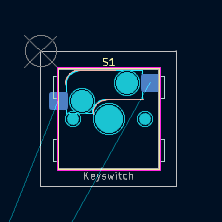
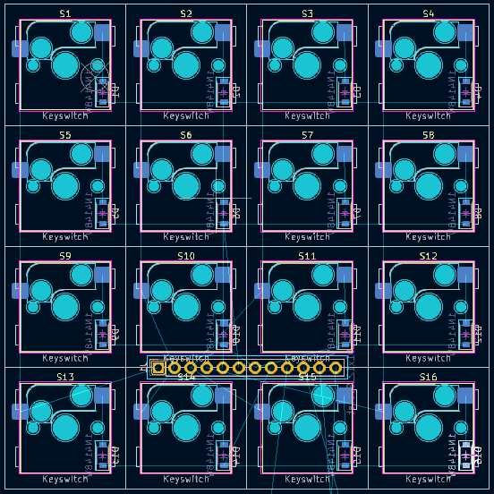
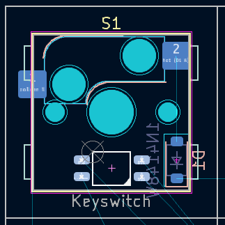

# Keycube project : Matrix documentation

> Le document a pour but d'expliquer comment a été réalisé la version de la matrice, par Léo CHEIKH-BOUKAL.
## Prérequis
### KiCad
*KiCad is a free software suite for electronic design automation. It facilitates the design and simulation of electronic hardware for PCB manufacturing*

L'installation du logiciel gratuit Kicad est requise pour le suivi de cette documentation. Celle-ci a été réalisée pour une utilisation avec Windows, l'utilisation sous d'autres systèmes pourrait différer. Celui-ci est téléchargeable en suivant [ce lien](https://www.kicad.org/). Poursuivez sur le bouton download[*](#figure-1), sélectionnez votre plateforme, puis téléchargez l'excutable depuis le lien de votre choix (Github est recommandé).

Lancez l'installation avec les paramètres recommandés.

> Vous pouvez désormais lancer le logiciel KiCad et passer à la partie suivante.

### ScottoKeebs
*Scottokeebs est une collection de librairies mises à disposition par joe-scotto sur GitHub. Elle contient entre autres des éléments utiles pour la création du shield et des matrices de cette version du keycube.*

Rendez-vous sur le [dépot GitHub scottokeebs](https://github.com/joe-scotto/scottokeebs/tree/main). Clonez le dépôt (nécessite git) ou téléchargez-le au format zip[*](#figure-2). Extrayez si besoin le dossier **./Extras/ScottoKicad/** là où vous le désirez.

Créez un dossier 'KiCadLibs' (nommage libre) puis copiez les dossiers **3dmodels**, **footprints** et **symbols** depuis **scottokeebs/Extras/ScottoKicad/** à l'intérieur[*](#figure-3).

#### Paths

> Si vous n'avez pas déjà lancé le logiciel KiCad, lancez-le.

Dans KiCad, accédez depuis l'écran d'accueil au menu **Preferences > Configure Paths**. Ajoutez une nouvelle variable d'environnement, nommez-la, et définissez le chemin associé sur le dossier 'KiCadLibs' (ou autre) précédement créé[*](#figure-4). Appliquez les changements en appuyant sur **Ok**.

> Vous devriez revenir sur le menu principal de KiCad automatiquement.

#### Symbols

Dans KiCad, accédez depuis l'écran d'accueil au menu **Preferences > Manage Symbol Librairies**. Ajoutez le fichier **{KiCadLibs}/symbols/ScottoKeebs.kicad_sym**. Appliquez les changements en appuyant sur **Ok**.

> Vous devriez revenir sur le menu principal de KiCad automatiquement.

#### Footprints

Dans KiCad, accédez depuis l'écran d'accueil au menu **Preferences > Manage Footprint Librairies**. Ajoutez tous les dossiers présents dans **{KiCadLibs}/footprints/** par le biais de l'icone de dossier. Appliquez les changements en appuyant sur **Ok**.

> Vous devriez revenir sur le menu principal de KiCad automatiquement.

### Fabrication Toolkit

Dans KiCad, accédez depuis l'écran d'accueil au **Plugin and Content Manager**[*](#figure-5). Recherchez **"jlc"** dans la barre de recherche afin de trouver le plugin **"Fabrication Toolkit"**[*](#figure-6). Cliquez sur **Install** puis sur **Apply Pending Changes**.

> Vous pouvez maintenant fermer les fenêtres additionnelles et revenir au menu principal de KiCad. Tous les prérequis devraient être fonctionnels, passez à la partie suivante.

## Matrice 

Vous pouvez démarrer un nouveau projet en cliquant sur new Project ou le logo sur l'image ci-dessous.

Choisissez où vous voulez mettre votre projet (dans un dossier avec lequel vous stocker tous vos projets kicad par exemple) et
nommez-le.   
Normalement, une fois le projet créé, kicad va vous afficher deux fichiers : "[nom du projet].kicad_sch" et ".kicad_pcb."
(Voir ci-dessous)

Vous êtes prêt à faire votre clavier pour le keycube.

### Schémas

Lancez-le ".kicad_sch". Une fois lancez, une nouvelle fenêtre devrait apparaitre qui ressemble à ça

L'interface est réparti en 3 parties : 
- Le schema qui prend la majeure partie de l'écran sur la droite de l'image du dessus. C'est ici que le schema sera fait.
- Properties, la partie en bas à gauche qui va afficher les propriétés d'un symbole sélectionné.
- Et la barre d'outils en haut et à droite du schema qu'on va utiliser en général

> Schematic Hierarchy ne nous sera pas utile pour ce tutoriel. Vous pouvez fermer cette fenêtre.

> KiCad utilise plusieurs raccourcis claviers utiles pour la navigation et la composition. Retenez notement :
> - A : Add a symbol
> - R : Rotate a symbol
> - Ctrl+L : Add a label
> - Ctrl+S : Save
> - Ctrl+D : Duplicate
> - W : Add a wire
> - Delete : Delete an element
>
> Prenez garde à ne placer des éléments qu'à l'intérieur de la feuille de travail.

Passons au schéma. Le schéma est répartie en 2 parties :
- Le schéma du clavier avec les diodes
- Le schéma des LED.

Commençons par le clavier.

### Schéma : Clavier

Pour le clavier, commencer par créer un nouveau symbole. Sur la barre d'outils à droite, cliquer sur l'icône ci-dessous

 

Une liste de symbole devrait apparaitre sur votre écran comme ci-dessous.
> Note : Si cela n'apparait pas, tout en gardant le bouton "Add Symbol" sélectionné, cliquer n'importe où sur le schema 
et l'interface apparaitra.

 

À partir de là, chercher "Keyswitch" et cliquez sur le placeholder keyswitch de scotto keebs ci-dessous
> Note : si la librairie de Scotto Keebs n'apparait pas, il y a surement eu un problème à l'importation de la librairie.
> Retournez au prérequis et verifier qu'il n'y a eu aucun problème lors de l'installation.

Placez-le sur le côté gauche du schema (on garde la partie droite pour le schema des LED).
Maintenant, chercher "1N4148W" c'est le modèle de diode que nous allons utiliser, une diode SMD (Surface Mount Device).

Vous pouvez placer le symbole sur le schéma de cette facon avec le Keyswitch :

Maintenant, vous allez prendre votre ensemble de symbole et le dupliquer (cf. : raccourcis) de sorte à créer une 
matrice 4 par 4, en faisant en sorte d'avoir bien aligné chaque symbole. Le résultat devrait ressembler à ça :

On a une bonne base pour la matrice actuellement, la prochaine étape est de relier les touches entre elle. Avant ça, on
va créer la sortie de notre matrice. Ajouter un symbole et chercher "conn 01x12 socket". Vous pouvez le placer sur le 
côté gauche de la matrice.

Dernière étape, il va falloir relier toutes les touches de clavier et connecter tout ça, a la socket. Le but est de
relier les touches en colonne et les diodes en ligne. Chaque ligne et colonnes vont être relié à un label (cf. : 
raccourci) :

Si tout va bien, la matrice est bientôt fini. La matrice devrait ressembler à l'image ci-dessous.

> Note : Si vous ne voulez pas de LED sur votre matrice, vous pouvez vous arrêter à cette étape et passez directement à
> l'étape du PCB. Autre chose aussi, vous pouvez utiliser un connecteur 01x08 à la place du 01x12 si vous n'utilisez pas
> les LED.

### Schéma : LED

Il est temps de s'occuper des LED. On va utiliser des SK6812MINI, un modèle de LED utilisé dans un autre modèle de 
matrice que j'ai utilisé comme base pour apprendre à realisé schema et PCB. Les LED vont être relié entre elle et leur 
entrée, et sortie sera connecter au socket qu'on a placé précédemment.

Première étape, chercher et placer le symbole "SK6812MINI" et prenez celui de SKOTTO KEEBS (Leur PCB sont différents et 
c'est celui-ci qui nous intéressent). Vous le placez donc dans la partie droite du schéma (celle qu'on a réservée pour 
les LED). Puis, vous répétez le processus comme pour le clavier et aligner une matrice 4x4 ou la ligne 2 et 4 sont 
retournées. 

Ensuite, On va relier les LED entre elles avec le DIN et DOUT. Créez un Label DIN et DOUT à placer en haut à gauche et
en bas à droite devant DIN/DOUT des LED respectivement. Puis, vous les reliez entre eux en faisant une sorte de serpent 
en partant de en haut à gauche jusqu'à la LED en bas à gauche. (Si ce n'est pas clair, l'image du dessous vous aidera)

Il ne manque plus que le VSS et VDD. Créez un label de chaque puis relier chaque sortie au label correspondant. Je les 
ai reliés de cette manière.

Il suffit de dupliquer les labels et les relier au dernier socket de libre sur les connecteurs.

______________________________________________________________
Voilà votre schéma de la matrice est terminé !
Avant de passer au PCB, on doit attribuer le pcb au placeholder keyswitch.
Cliquez sur le bouton "Assign Footprint" dans la barre outils du haut. Vous devriez arriver dans un menu comme celui-ci.

Normalement, les Keyswitchs dans la colonne du milieu devrait être vide ainsi que le conn_01x12 (ou 08 si vous n'avez 
pas fait la partie des LED).
> Note : La colonne du milieu représente vos symboles de votre schema ainsi que leurs associations avec leur footprint, 
> soit ce qui les représente dans le PCB. La colonne de droite représente la liste des footprints qu'on assigne. Celle
> de gauche, c'est chacune des librairies. On peut chercher un footprint précis dans la barre de recherche en haut ainsi
> que les options possibles à côté qui permettent de filtrer.

Commençons par le connecteur, cliquez sur le conn de la colonne du milieu et chercher dans la barre de recherche 
"PinHeader 2.54 1x12", 4 options devrait apparaitre. Double Cliquez sur la version verticale. 
Normalement, l'assignation a dû être fait, la ligne concernée devrait avoir changé.
Ensuite les Keyswitchs, pour aller plus vite, selectionnez tous les keyswitchs (shift+click sur le premier et dernier de
la liste) et Cherchez "Hotswap MX 1.0" puis double click sur le "ScottoKeebs_Hotswap:Hotswap_MX_1.00u" (attention à 
clicker sur le bon).

Si tout est bon, cela devrait ressembler à ça :

Et voilà votre matrice est terminé. Passons au PCB.
> Note : Dans le cas de notre projet, je l'ai designer de cette manière et attribuer les footprints selon mon point de 
> vue. Il est totalement possible d'utiliser d'autre librairie, utilisé d'autre LED ou Diode voir meme de Keyswitch. 
> Je ne peux pas designer votre schema ou PCB, il est à vous de savoir ce que vous voulez garder ou modifier selon vos 
> objectifs personnels sur un projet ou sur celui-ci si vous voulez l'améliorer (et je ne suis pas detenteur de la 
> vérité, À l'heure actuelle, cela fait 3 mois que j'ai commencé à apprendre a utilisé KiCad et comprendre les 
> schéma et PCB). Donc soyez libre d'utiliser ce travail comme bon vous semble.

### Matrice : PCB

Dans le même principe que le schéma, on va placer les éléments de notre matrice et les relier entre eux.
Pour commencer, allons voir le PCB en cliquant sur "Switch to PCB Editor" dans la bar d'outils du haut. C'est un bouton
vert comme un circuit. Vous devriez arriver sur cette interface : (Vous pouvez aussi par le menu principal et ouvrir le 
fichier "[Votre Projet].kicad_pcb") 

L'interface se sépare en 2 parties :
- Le grand cadre au milieu où on va créer notre PCB
- Le reste s'est nos outils pour créer ce pcb (ou manipuler notre fichier PCB).

Première étape, on va mettre à jour notre PCB en fonction de notre schema qu'on le vient de créer. Cliquer sur le bouton
"Update PCB From Schematic...", une interface va apparaitre et vous pouvez cliquer sur le bouton en bas à droite 
"Update PCB" puis "Close". Normalement, beaucoup de chose devrait apparaitre, puisque chaque symbole du schéma a été 
extrait du schéma. (Verifiez, donc, que tout est là)

Prochaine étape, on va placer nos Keyswitch en premier. Avant ça, on va créer un quadrillage afin de bien placer chacune
de nos touches, sans devoir les placer à la main de facon approximative. Cliquez sur l'avant-dernier menu déroulant en 
partant d'à droite, en haut de l'interface. Puis cliquez sur "Edit Grids", une interface listant chacune des grilles 
possibles, avec plus au moins d'espaces (0.01 mm jusqu'à 25.4 mm). On va créez le nôtre, adapté à nos touches de clavier.
Cliquez sur la croix en bas de la liste, une autre interface apparaitra avec les champs "name", "X", "Y". Vu que nos 
touches sont carré, on va juste remplir "name" et "X". Choisissez un nom (de mon côté, j'ai mis "Grid hotswap MX") et 
mettez 19.05 pour X (c'est la taille des hotswap MX). Cliquez sur "OK" et notre grille est apparu dans la liste.

 

> Note : Dans mon cas, ma grille fait la taille d'une touche, mais ce n'est pas obligatoire. Vous pouvez diviser sa 
> taille de sorte à ne déplacer que de 1/2 de touches ou 1/4. C'est à votre convenance. Plus votre grille est précise
> plus, vous déplacerez les éléments précisement.
> 
> Evidemment, si vous utilisez différentes touches avec un format différent, les valeurs peuvent différer et 
> la grille n'est pas forcément carré. À ce moment-là, décocher linked, et modifier les valeurs en fonction.

Maintenant, on va placez l'origine de notre grille. Cliquez sur le bouton "Place the grid origin point" dans la barre 
d'outils à droite (Avant dernier bouton en partant du haut). Puis placer votre point d'origine là où voulez placer votre
matrice (En général, on place l'origine en haut à gauche de la matrice), un cercle et une croix devrait apparaitre. 
Une fois fait, changer de grille, si ce n'est pas deja fait, pour celle que nous avons créée. puis selectionnez une de 
vos touches, et clique droit, Positioning tools → Move with reference ensuite, sélectionnez un des coins de votre touche
(En haut à gauche pour moi). Déplacez-le en fonction de votre origine. Voilà le résultat :

Vous pouvez maintenant répéter la meme étape jusqu'à créer votre matrice.

> Note : N'oubliez pas de respecter votre schema et l'ordre des touches, sinon vous allez avoir quelque soucis dans les
> branchement de votre PCB

Vous avez la base de votre matrice déjà. On va directement placer notre conecteur. 
> Note : Un PCB a plusieurs couches. Dans mon cas, on utilise que les deux cotés du PCB (Front layer et Back Layer).
> Selon votre besoin, et votre budget, vous pourriez avoir besoin de couche supplémentaire. Dans ce cas, renseignez-vous
> sur comment faire pour utiliser les autres layers. 

Le but est de placer les connecteurs entre les touches pour compresser au mieux la matrice. Donc oublions les bords de 
la matrice, on va placer soit à la verticale ou horizontal. Dans mon cas, je l'ai placé dans à l'horizontal, dans un cas
futur où l'on devrait rétrécir un peu la matrice, vu qu'il y a plus de place entre les lignes plutôt que les colonnes, 
il y aura plus de marge pour rétrécir.
Dernière chose, de base, votre connecteur est tourné du mauvais côté (coté clavier), selectionnez votre connecteur et 
cliquez sur "F". Le connecteur sera retourné du bon côté. Voilà ma matrice :

Passons à la Diode. Chaque diode est relié à sa touche donc, doit être placé au bon endroit sur la bonne touche. 
Avant cela, comme pour le connecteur, switcher toutes les diodes du bon côté et cliquez sur "R" jusqu'à que chaque diode
soit dans ce sens (comme celui du schéma) :

Une fois fait placer les en fonctions des touches comme ceci :

Faites pareil pour chaque diode et touches de clavier.

> Note : vous pouvez réutiliser la meme methode que pour les touches pour être sûr de l'aligner et de bien les espacés. 
> En placant l'origine dans le coin de la diode (cf. Le screen juste au-dessus) et en utilisant "move with reference" et
> en placant la reference dans le coin de la diode. C'est plus rapide et efficace.

Voilà le résultat :

La prochaine étape ne concerne que ceux qui ont réalisé le schéma des LED précédemment. Le principe est le même :
 - Retournez les LED du bon côté
 - Placez les LEDs (vous pouvez utiliser la meme astuce que pour les diodes et touches de claviers) comme ceci :

Voilà le résultat de la matrice avec tous les éléments placés :

Il manque plus qu'à relier tous les éléments entre eux. Vous avez deux options :
- Tous faire à la main, pour un contrôle totale et verifier chaque lien entre eux (déconseillé pour un débutant)
- ou Utiliser un plugin pour relier automatiquement (Exemple de plugin : Freerouting)

La première méthode est un peu longue, car il vous faut relier tout à la main, en utilisant les deux layer disponible et
respectant une delimitation.
La deuxième est plus simple, mais il est souvent nécessaire de repasser derriere le plugin pour verifier qu'il n'y est 
aucune erreur ou lien vers du vide.

Dans les deux cas, le choix et la facon dont vous allez tout relier vous est propre. Je vais montrer mon résultat, mais 
il n'est pas nécessairement mieux qu'un autre. Voyez-le comme un exemple d'une possibilité :

> Note : le filtre rouge permet de mettre en surbriance les routes d'un côté de la matrice ou d'un autre. Et aussi, j'ai 
> defini en plan de coupe pour la board de la matrice. Ce qui permet de pouvoir la visualiser correctement en 3D 
> (accessible dans View→3D Viewer). Pour ça selectioner le layer "Edge.Cuts" puis dessiner un rectangle, grace au bouton
> du meme nom sur la droite, tout autour de la matrice. 
> Si vous voulez la surbrillance, ajouter une filled zone (dans la barre d'outils, un menu va apparaitre). Selectionner 
> les deux layer front et back) et entourer la matrice. Et enfin, appuyer sur B pour filled the zone. Voilà, c'est fini.

Bravo ! Vous venez de réaliser une matrice de clavier 4x4. 