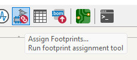

# Keycube shield v1 documentation
## Prérequis
### KiCad
*KiCad is a free software suite for electronic design automation. It facilitates the design and simulation of electronic hardware for PCB manufacturing*

L'installation du logiciel gratuit Kicad est requise pour le suivi de cette documentation. Celle-ci à été réalisée pour une utilisation avec Windows, l'utilisation sous d'autres systèmes pourrait différer. Celui-ci est téléchargeable en suivant [ce lien](https://www.kicad.org/). Poursuivez sur le bouton download[*](#figure-1), sélectionnez votre plateforme, puis téléchargez l'excutable depuis le lien de votre choix (Github est recommandé).

Lancez l'installation avec les paramètres recommandés.

> Vous pouvez désormais lancer le logiciel KiCad et passer à la partie suivante.

### ScottoKeebs
*Scottokeebs est une collection de librairies mises à disposition par joe-scotto sur GitHub. Elle contient entre autres des éléments utiles pour la création du shield et des matrices de cette version du keycube.*

Rendez vous sur le [dépot GitHub scottokeebs](https://github.com/joe-scotto/scottokeebs/tree/main). Clonez le dépôt (nécessite git) ou téléchargez le au format zip[*](#figure-2). Extrayez si besoin le dossier **./Extras/ScottoKicad/** là où vous le désirez.

Créez un dossier 'KiCadLibs' (nommage libre) puis copiez les dossiers **3dmodels**, **footprints** et **symbols** depuis **scottokeebs/Extras/ScottoKicad/** à l'intérieur[*](#figure-3).

#### Paths

> Si vous n'avez pas déjà lancé le logiciel KiCad, lancez-le.

Dans KiCad, accédez depuis l'écran d'accueil au menu **Preferences > Configure Paths**. Ajoutez une nouvelle variable d'environnement, nommez-la, et définissez le chemin associé sur le dossier 'KiCadLibs' (ou autre) précédement créé[*](#figure-4). Appliquez les changements en appuyant sur **Ok**.

> Vous devriez revenir sur le menu principal de KiCad automatiquement.

#### Symbols

Dans KiCad, accédez depuis l'écran d'accueil au menu **Preferences > Manage Symbol Librairies**. Ajoutez le fichier **{KiCadLibs}/symbols/ScottoKeebs.kicad_sym**. Appliquez les changements en appuyant sur **Ok**.

> Vous devriez revenir sur le menu principal de KiCad automatiquement.

#### Footprints

Dans KiCad, accédez depuis l'écran d'accueil au menu **Preferences > Manage Footprint Librairies**. Ajoutez tous les dossier présents dans **{KiCadLibs}/footprints/** par le biais de l'icone de dossier. Appliquez les changements en appuyant sur **Ok**.

> Vous devriez revenir sur le menu principal de KiCad automatiquement.

### Fabrication Toolkit

Dans KiCad, accédez depuis l'écran d'accueil au **Plugin and Content Manager**[*](#figure-5). Recherchez **"jlc"** dans la barre de recherche afin de trouver le plugin **"Fabrication Toolkit"**[*](#figure-6). Cliquez sur **Install** puis sur **Apply Pending Changes**. Recherchez ensuite **"freerouting"** et installez de la même manière le plugin **Freerouting**.

> Vous pouvez maintant fermer les fenêtres additionnelles et revenir au menu principal de KiCad. Tous les prérequis devraient être fonctionnels, passez à la partie suivante.

## Shield

Accédez à **File > New Project**, nommez votre projet, choisissez son emplacement.

> Plusieurs fichiers sont créés lors de la création du projet, pour plus de confort, travaillez dans un dossier.

> Deux fichiers devraient maintenant appraitre dans la fenêtre KiCad, un kicad_pcb et un kicad_sch

### Schematic

Ouvrez le fichier kicad_sch.

> KiCad utilise plusieurs raccourcis claviers utiles pour la navigation et la composition. Retenez notement :
> - A : Add a symbol
> - R : Rotate a symbol
> - Ctrl+L : Add a label
> - Ctrl+S : Save
> - W : Add a wire
> - Delete : Delete an element
> 
> Prenez garde à ne placer des éléments qu'à l'intérieur de la feuille de travail.

Ajoutez un symbole **MCU_Raspberry_Pi_Pico** à votre schéma[*](#figure-7).

Ajoutez un label **GPI06** et placez-le sur **la pin 9 (GPI06)** du Pico. Répétez l'opération pour les GPI07, 08, 09, 010, 011, 012, 013, 014, 015, 016, 017, 018, 019, 020, 021, 022, 026, 027 et 028, **soit 20 pins en tout**. Ajoutez un label **GND** sur **la pin 8 (GND)**, puis un label V sur **la pin 40 (VBUS)**.

> Vous devriez obtenir un schéma semblable à celui trouvable dans les [Annexes](#annexes) en [figure 8](#figure-8).

Placez un connecteur **Conn_01x12_Pin**. Reliez **la pin 8** du connecteur à **la pin 1** du Pico avec un wire. Reliez ensuite les pins de 9 à 12 du connecteur au GP01, GP02, GP03, et GP04 du Pico. La pin GP05 du Pico doit rester libre. Reliez les pins du connecteur restantes avec des labels GND et V comme bon vous semble (il est plus simple de les grouper).

> Vous devriez obtenir un schéma semblable à celui trouvable dans les [Annexes](#annexes) en [figure 9](#figure-9).

Placez cinq autres connecteurs **Conn_01x12_Pin** dans votre schéma en les espaçant suffisement. Ajoutez des labels correctement nommés et placez-les selon la [figure 10](#figure-10). N'oubliez pas de relier les matrices entre elles dans le bon ordre, par le biais des pins 11 et 12. Laisser la pin 12 de la matrice 5 libre.

> Vous devriez obtenir un schéma semblable à celui trouvable dans les [Annexes](#annexes) en [figure 10](#figure-10). N'oubliez pas de sauvergarder votre travail régulièrement.

Reliez finalement la pin 7 du pico (GP05) à la broche 11 de la Matrice 1.

### Footprints

Depuis le schéma KiCad, accédez à l'action **Assign footprints** comme indiqué en [figure 11](#figure-11). Sélectionnez tous vos connecteurs (6) **Conn_01x12_Pin** dans la fenêtre centrale (Footprint Assignments). Entrez **"1x12_P2.00"** dans la barre de recherche en haut de l'écran principal. Dans la fenêtre de droite (Filtered Footprints) double-cliquez sur **Connector_PinHeader_2.00mm:PinHeader_1x12_P2.00mm_Vertical**.

> Attention, il existe beaucoup de connecteurs similaires pour cette assignation, prenez garde à sélectionner le bon connecteur, à moins de savoir exactement ce que vous faites.

Utilisez ensuite le même procédé pour assigner **ScottoKeebs_MCU:Raspberry_Pi_Pico** (fenêtre de droite) à votre **Raspberry_Pi_Pico** (fenêtre centrale).

> Vous devriez obtenir dans la fenêtre centrale le même résultat que vu en [figure 12](#figure-12). Si tel est le cas, vous pouvez passer à la suite.

Cliquez sur **Apply, Save Schematic & Continue**, puis fermez cette fenêtre pour revenir au schéma électrique. 

Cliquez sur le bouton vert **Switch to PCB Editor** comme indiqué en [figure 13](#figure-13).

> L'éditeur de PCB devrait s'ouvrir automatiquement. Vous pouvez désormais passer à la partie suivante.

### PCB Editor

Depuis l'éditeur PCB, appuyez sur **F8** pour actualiser le PCB en fonction du schéma créé dans les étapes précédante. Un panneau semblable à celui présenté en [figure 14](#figure-14) devrait s'ouvrir. Cliquez sur **Update PCB** puis sur **Close**.

> Une fois le panneau fermé, les empreintes correspondantes devraient apparaitre dans l'éditeur tel que présenté en [figure 15](#figure-15).

L'éditeur vous permet de tourner et déplacer les éléments présents. Placez les connecteurs autour du Pico comme présenté en [figure 16](#figure-16).

> **Attention**, étant donné que la prise usb-c du pico est accessible depuis l'une des faces du produit final, les connecteurs **ne doivent pas dépasser vers le haut**.

Utilisez ensuite l'option ajoutée par le plugin freerouting, en cliquant sur le bouton Freerouting dans la barre d'outils principale (voir [figure 17](#figure-17)). Laissez l'opération tourner, cela peut prendre un certain temps. Une fois toute les opérations terminées, vous devriez revenir automatiquement sur l'éditeur pcb de Kicad, avec éventuellement une fenêtre de warning que vous pouvez ignorer.

> Désormais, les routes devraient être faites de manière optimales, c'est à dire que les points du circuit devant être reliés électriquement le sont d'une façon plutot optimale. **Attention** il arrive cependant que l'utilisation du freerouting génère des résidus de routes n'étant reliées à rien. Il est donc important de les identifier et les supprimer.

Prenez le temps d'analyser les routes tracées et de nettoyer les éventuelles routes résiduelles.

Dans la barre latérale droite, sélectionnez l'option **"Draw a Rectangle"** (voir [figure 18](#figure-18)). Dans le volet **Appearance**, sélectionnez la couche **Edge.Cuts** comme présenté en [figure 19](#figure-19). Tracez un rectangle autour de votre pcb. Il s'agira des bords de celui-ci et déterminera sa taille lors le la découpe.

> Prenez garde lors du choix de la taille du rectangle à
> - Laisser un peu de marge autour des composants
> - Englober tous les composants et routes
> - Ne pas laisser trop de vide sur le circuit

Dans le volet **Appearance**, sélectionnez la couche **F.Cu**. Sélectionnez ensuite, toujours dans la barre latérale droite, l'action **Add filled zone** (Crtl+Shift+Z). Un nouveau panneau s'ouvre alors. Dans la partie gauche, sélectionnez les deux couches **F.Cu** et **B.Cu** comme présenté en [figure 20](#figure-20), puis sélectionnez **Ok**. Tracez ensuite une zone autour de tout le PCB (la forme de la zone n'a pas grande importance, mais faites un rectangle de préférence). Appuyez ensuite sur la **touche B**. Un effet de surbrillance doit apparaitre sur le circuit.

> Le PCB est désormais presque terminé. Il ne reste plus qu'a procéder aux vérifications.

Dans la barre du haut, cliquez sur le bouton **Design Rule Checker** (voir [figure 21](#figure-21)). Un nouveau panneau d'ouvre, cliquez sur **Run DRC**.

> Une liste d'avertissements et/ou d'erreurs devraient s'afficher. Si vous n'avez aucune erreur, vous pouvez avancer. Dans le cas contraire, prenez le temps, en lisant les indications du logiciel, de corriger ces erreurs. Le plus souvent, il s'agira de points que vous avez oublié de relier, ou de routes mal placées par Freerouting. ces quelques corrections effectuées, passez à la suite.

Si vous êtes arrivés jusqu'ici, bien joué ! Vous avez terminé votre PCB ! Si vous souhaitez l'exporter, cliquez sur le bouton **Fabrication Toolik** puis sur **Generate** et voilà !

## Pour aller plus loin

> Dans cette partie, nous allons revenir sur certains des choix, certaines décisions, certains objectifs, et certaines démarches qui nous ont menés à cette version 1.

Le keycube, comme tout produit expérimental obéit à des contraintes et doit répondre à un certain besoin. Etant donné qu'il s'agit d'un objet peu conventionnel, c'est à dire que les utilisateurs potentiels n'ont très probablement jamais essayé un produit similaire, il est important qu'il soit le plus attractif possible. Pour l'utilisateur, tester le keycube serait déjà une contrainte, car il devrait apprendre à l'utiliser d'abord. Il faut donc adoucir tous les autres aspects le plus possible.

Dans cette logique, il convient que le keybcube devrait par exemple :
- Être le plus simple à manufacturer possible.
- Offrir la possibilité aux plus bricoleurs de faire évoluer leur cube.
- Coûter le moins cher possible.
- Être une plateforme de développement et d'innovation accessible.

Pour ce qui est de la conception du shield, ces éléments doivent être pris en compte à chaque étape, de la conception du schéma électrique, jusqu'au montage final. 

Afin de limiter les coûts et la complexité des PCB, il convient par exemple d'essayer de réaliser une version tenant sur uniquement 2 couches conductives. L'utilisation de plus de couches est bien sur toujours possible, mais elle est souvent plus chère et plus laborieuse à reprendre en cas de passage de main du projet. 

Le shield doit également respecter des contraintes de taille strictes. La taille du prototype principal du keycube ayant été étudiée précédement, il convient de ne pas avoir à augmenter la taille du produit final.

Les matrices connectées au shield ont été conçues pour qu'il soit possible de débrancher une ou plusieurs d'entre elles dans le cas où un utilisateur voudrait utiliser les pins autrement. Afin de conserver le rétroéclairage des touches actifs, il convient cependant de les déconnecter selon le bon ordre. Les matrices sont reliés au shield en série de la première à la cinquième.

Il convient de garder les documentations à jour, afin d'assurer la prérénité du projet, en particulier après des changements apportés au shield et/ou aux matrices.

Le shield tel que décris dans cette documentation n'a, à ce jour pas pu être testé en conditions réelles. Il sera donc nécessaire d'effectuer et documenter les résultats des tests afin de corriger les éventuelles erreurs, et aboutir probablement à une nouvelle version.

## Annexes

### Figures

#### figure 1

#### figure 2

#### figure 3

#### figure 4

#### figure 5

#### figure 6

#### figure 7

#### figure 8

#### figure 9

#### figure 10

#### figure 11

#### figure 12

#### figure 13

#### figure 14

#### figure 15

#### figure 16

#### figure 17

#### figure 18

#### figure 19

#### figure 20

#### figure 21

### Sources complémentaires

[**How to Design Mechanical Keyboard PCBs with Kicad** - Joe Scotto - Video](https://www.youtube.com/watch?v=8WXpGTIbxlQ)

[**How a Mechanical Keyboard Works (Matrix and Direct Wiring)** - Joe Scotto - Video](https://www.youtube.com/watch?v=7LyziNdFlew)

[**11 Best High-Speed PCB Routing Practices** - Sierra Circuits - Post](https://www.protoexpress.com/blog/best-high-speed-pcb-routing-practices/)

[**An Intro to KiCad – Part 1: How PCBs Are Made | DigiKey** - DigiKey - Video](https://www.youtube.com/watch?v=vaCVh2SAZY4&list=PLEBQazB0HUyR24ckSZ5u05TZHV9khgA1O)

### Pour finir

*Merci Damien pour le suivi du projet et tes conseils. Bon courage aux futures équipes et développeurs du KeyCube !*